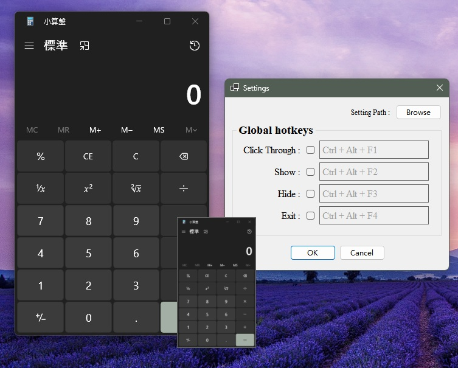

# WndView

## How to use
**On icon of the taskbar:**
* Click the left mouse button: Click through switch
* Click the right mouse button: Options

**In the window:**
* Click the right mouse button: Select the program
* Hold down the left mouse button: Move the window

## Usage Notes
> [!IMPORTANT]
> Certificate installation
> 1. Right-click on the ".msixbundle" file and select "Properties". Then, go to the "Digital Signatures" tab. In the "Embedded Signatures" section, select an entry, click "Details", then "View Certificate", and finally "Install Certificate...".
> 2. In the "Store Location" section, select "Local Machine" and click "Next".
> 3. Choose "Place all certificates in the following store", then click "Browse..." Select "Trusted Root Certification Authorities", click "OK", then "Next", and finally "Finish".
> 4. Close all windows and run the ".msixbundle" file to proceed with installation.
* Supported languages: English, Traditional Chinese
* The capture program cannot use exclusive full-screen mode.
* The capture program must run in the foreground.

## Requirements
* OS: Windows 11
* Build: 10.0.22000.0 or higher.
* Architecture: x64

